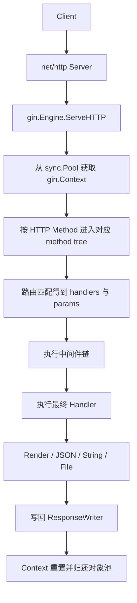

# Learn Gin

## 写在前面

这份文档基于当前目录下的 `Struct.md` 展开，目标不是只列提纲，而是把提纲中的每个章节都补成一份可以真正拿来学习、复盘与实践的 Gin 学习笔记。内容以 Gin 的核心设计思想、源码结构、运行流程和生产实践为主线，同时补充必要的 Go 标准库背景，帮助你建立从 `net/http` 到 Gin 的完整认知链路。

建议阅读方式：

1. 先理解 Gin 与 `net/http` 的关系，再看 `Engine`、路由树和 `Context`。
2. 中间件、绑定与渲染属于“围绕核心扩展出来的能力”，理解它们时要始终回到请求流转过程。
3. 最后再看生产实践与 Mini-Gin，这样会更容易把“原理”和“实现”对应起来。

---

## 第一部分：初识与全景（Overview）

本部分从宏观角度俯瞰 Gin 框架，了解其在 Go 原生 `net/http` 基础上的定位与整体架构。

### 第 1 章：Gin 框架概述

#### 1.1 为什么选择 Gin？（轻量、高性能、易用性）

Gin 是 Go Web 生态中非常流行的一个 HTTP 框架，它的成功并不只是因为“快”，更因为它在性能、易用性和工程化之间取得了很好的平衡。

选择 Gin 的常见原因包括：

- 轻量：Gin 的核心非常聚焦，主要围绕路由、上下文、中间件、绑定和渲染展开，没有引入过重的框架约束。
- 高性能：Gin 的路由基于 Radix Tree，匹配效率高；同时通过 `sync.Pool` 复用 `Context`，减少请求处理过程中的对象分配。
- 易用性：API 风格接近直觉，`GET`、`POST`、`Group`、`Use`、`JSON` 这些接口都很容易上手。
- 工程友好：内置日志、异常恢复、参数绑定、校验、模板渲染等常见能力，适合快速构建业务系统。
- 生态成熟：社区中间件丰富，文档齐全，学习资料多，适合个人学习和团队开发。

如果把 Go Web 开发放在一个光谱上看：

- `net/http` 更偏底层，灵活但样板代码较多。
- Gin 处于中间层，在保留 Go 风格的前提下提供了高效封装。
- 更重型的框架则可能带来更多“约定优于配置”的体验，但同时也会失去一部分简洁性。

所以，Gin 的吸引力本质上是：它没有把 Go Web 开发变得“魔法化”，而是在标准库之上做了一层非常克制但高价值的抽象。

#### 1.2 Gin 与原生 `net/http` 的关系

理解 Gin 的第一步，是认识到它并不是绕开了 Go 标准库，而是建立在 `net/http` 之上的。

Go 原生 Web 服务的入口通常是这样的：

```go
http.ListenAndServe(":8080", handler)
```

其中第二个参数需要满足 `http.Handler` 接口：

```go
type Handler interface {
    ServeHTTP(ResponseWriter, *Request)
}
```

Gin 的核心类型 `gin.Engine` 正是这个接口的实现者，因此它可以直接作为 `http.ListenAndServe` 的处理器：

```go
r := gin.New()
http.ListenAndServe(":8080", r)
```

这说明：

- Gin 没有替代 HTTP 协议层，它仍然运行在 Go 标准库提供的网络模型之上。
- Gin 的主要工作是接管 `ServeHTTP` 之后的请求分发、上下文封装、中间件执行和响应输出。
- `http.Request` 和 `http.ResponseWriter` 依然是真实的底层对象，Gin 只是对它们做了更易用的封装。

因此，学习 Gin 最好的方式不是把它当成“黑盒框架”，而是把它当成 `net/http` 的增强层。

#### 1.3 Gin 框架的整体架构图解

从宏观上看，Gin 的一次请求处理可以理解为下面这条链路：



可以把 Gin 划分为几个核心模块：

- 入口层：`Engine`
  - 负责维护路由树、中间件、模板、对象池等全局能力。
- 路由层：Router Tree
  - 负责把 URL 路径和 HTTP Method 映射到目标处理链。
- 上下文层：`Context`
  - 封装请求、响应、参数、状态流转和用户自定义数据。
- 中间件层：Middleware
  - 通过责任链模型对请求做统一拦截和增强。
- 绑定与校验层：Binding / Validation
  - 负责把请求数据反序列化到结构体，并进行规则校验。
- 渲染层：Render
  - 负责把业务结果格式化为 JSON、HTML、XML、文本等响应内容。

从架构风格上说，Gin 的特点是：

- 中央核心很小；
- 扩展能力围绕 `Context` 展开；
- 路由、中间件、绑定、渲染都通过接口和组合而不是复杂继承实现。

#### 1.4 环境准备与源码阅读指南

学习 Gin 的源码，建议先准备三个层面的环境：

1. Go 开发环境
   - 安装较新的 Go 版本。
   - 会使用 `go mod init`、`go get`、`go test`、`go doc`。
2. Gin 示例项目
   - 创建一个最小可运行项目，用于边看源码边打断点。
3. 调试与阅读工具
   - VS Code / GoLand。
   - 能查看定义、调用链、结构体字段和接口实现。

一个最小示例：

```go
package main

import "github.com/gin-gonic/gin"

func main() {
    r := gin.Default()
    r.GET("/ping", func(c *gin.Context) {
        c.JSON(200, gin.H{"message": "pong"})
    })
    r.Run(":8080")
}
```

推荐源码阅读顺序：

1. `gin.New()` / `gin.Default()`
2. `Engine` 结构体
3. `Engine.Run()` 与 `ServeHTTP()`
4. 路由注册相关代码
5. 路由匹配相关代码
6. `Context` 及其常用方法
7. 中间件执行机制
8. `binding` 与 `render` 子包

阅读源码时建议关注三个问题：

- 这个能力对外暴露的 API 是什么？
- 它内部如何组织数据结构？
- 它为什么这样设计，解决了什么性能或可维护性问题？

补充建议：

- 不要一开始就试图把所有细节看完。
- 先建立“请求从哪里来，到哪里去”的主线，再填充局部实现。

---

## 第二部分：顶层入口（The Top - Engine）

从最顶层的 API 入手，看一个请求是如何从操作系统进入 Gin 框架的。

### 第 2 章：核心引擎 `gin.Engine`

#### 2.1 `gin.New()` 与 `gin.Default()` 的底层差异

这两个函数都用于创建 Gin 引擎，但定位不同。

`gin.New()`：

- 创建一个纯净的 `Engine`。
- 不自动挂载任何默认中间件。
- 适合对链路完全自定义的场景。

`gin.Default()`：

- 本质上也是先创建一个 `Engine`。
- 然后自动注册两个常见中间件：
  - `Logger()`
  - `Recovery()`

也就是说，`Default()` 可以理解为：

```go
engine := gin.New()
engine.Use(gin.Logger(), gin.Recovery())
return engine
```

这两者差异看似简单，实际体现了 Gin 很重要的设计哲学：

- 核心能力和默认体验分离。
- 框架不强迫你接受任何默认行为。
- 但它又提供“开箱即用”的最佳实践。

在生产环境中如何选择：

- 想要最快启动项目，用 `gin.Default()`。
- 需要自定义日志、恢复策略、请求链路、监控中间件顺序时，用 `gin.New()` 更清晰。

#### 2.2 `Engine` 结构体深度剖析

`gin.Engine` 是整个框架的总控中心。它既是 HTTP 入口，也是路由和全局配置的持有者。

可以从职责上理解它包含的核心内容：

- 路由相关数据
  - 方法树集合 `methodTrees`
  - 最大参数数量、最大分段数量等辅助信息
- 中间件相关数据
  - 全局中间件链
- 上下文池
  - 使用 `sync.Pool` 复用 `Context`
- 模板与渲染配置
  - HTML 模板对象、函数映射等
- 代理、重定向、路径修复等行为开关
- 安全与兼容配置
  - 例如是否处理 `X-Forwarded-For`、是否信任代理

从抽象角度看，`Engine` 做了四件事：

1. 在启动前接收配置与路由注册。
2. 在运行时作为 `http.Handler` 接管请求。
3. 在请求进入后构造执行上下文。
4. 在请求结束后回收上下文并准备下一次复用。

这也是为什么 `Engine` 是学习 Gin 时必须彻底理解的第一个核心结构。

#### 2.3 桥接原生 HTTP：`ServeHTTP` 方法的实现

`ServeHTTP` 是 Gin 接入 `net/http` 世界的关键点。

流程可以概括为：

1. 从 `sync.Pool` 中取出一个 `Context`。
2. 重置 `Context`，绑定新的 `Request` 和 `ResponseWriter`。
3. 调用内部处理流程进行路由匹配和中间件执行。
4. 请求结束后清理 `Context` 状态。
5. 把 `Context` 放回对象池。

这一设计的价值在于：

- 避免每个请求都重新分配上下文对象。
- 把请求生命周期中常用的状态集中管理。
- 让上层 Handler 的签名保持简单：

```go
func(c *gin.Context)
```

从 `net/http` 的角度看，Gin 只是一个实现了 `ServeHTTP` 的处理器；但从 Gin 内部看，`ServeHTTP` 是一切高级能力的入口。

#### 2.4 请求生命周期：从 `ListenAndServe` 到 Gin 的接管

一次请求从客户端发到业务代码，中间大致会经历如下流程：

1. 客户端发起 TCP 连接和 HTTP 请求。
2. `net/http` 监听端口并解析请求报文。
3. `http.Server` 调用注册的 `Handler`，也就是 `gin.Engine`。
4. Gin 在 `ServeHTTP` 中构造 `Context`。
5. 根据请求方法和路径匹配路由树。
6. 把匹配到的中间件与最终 Handler 组合成执行链。
7. 依次执行链路中的函数。
8. 业务逻辑通过 `Context` 写回响应。
9. 请求结束，Gin 回收上下文。

在这个过程中需要注意：

- Gin 不负责底层 socket 管理，那是 `net/http` 的职责。
- Gin 最核心的价值发生在第 4 步到第 8 步。
- 你写的绝大多数业务代码，实际上只是在参与 Gin 构建好的执行链。

补充理解：

- `r.Run()` 本质上是对 `http.ListenAndServe` 的便捷封装。
- 如果需要更细粒度控制，比如超时、TLS、优雅关闭，应直接使用 `http.Server` 配合 `Engine`。

---

## 第三部分：深潜核心（The Inside - Router & Context）

探寻 Gin 性能卓越的真正秘密，底层的路由树与贯穿始终的上下文。

### 第 3 章：极致性能的路由树（Radix Tree）

#### 3.1 什么是基数树（Radix Tree）？与传统正则路由的对比

基数树可以视为一种对前缀进行压缩的 Trie。它特别适合做 URL 路径这种“分段明确、共享前缀很多”的匹配工作。

例如这些路由：

- `/user/login`
- `/user/logout`
- `/user/profile`

它们共享前缀 `/user/`，基数树会把公共部分压缩存储，从而减少重复节点和匹配成本。

与传统正则路由相比：

- 正则路由灵活，但匹配开销通常更高。
- 基数树更适合高频、结构清晰的 URL 路由场景。
- Gin 把动态参数和通配符也整合到了树结构中，因此既快又够用。

Gin 选择 Radix Tree 的本质原因是：

- URL 路径天然适合前缀匹配。
- 大多数 Web 路由并不需要完整正则表达式的极致灵活性。
- 在高并发下，低分配、少回溯、少比较比“表达能力无上限”更重要。

#### 3.2 Gin 路由树的节点结构（`node` 结构体）

Gin 路由树中的节点并不是简单的“一个字符一个节点”，而是按路径片段压缩后的节点。

一个节点通常包含这些关键信息：

- `path`
  - 当前节点持有的路径片段。
- `indices`
  - 子节点首字符索引，用于快速选择分支。
- `children`
  - 子节点列表。
- `handlers`
  - 当该节点对应完整路由时，保存处理函数链。
- `priority`
  - 用于优化热点路径分支排序。
- `nType`
  - 节点类型，例如静态、参数、通配符。
- `wildChild`
  - 是否包含通配子节点。
- `fullPath`
  - 完整注册路径，便于调试与错误提示。

这个设计体现出几个工程思路：

- 静态匹配优先。
- 用少量额外字段换取更快的查找效率。
- 把参数路由和通配符路由纳入统一树结构，而不是额外外挂一个特殊匹配器。

#### 3.3 路由注册过程：静态路由、参数路由（`:`）与通配符路由（`*`）

当我们写出：

```go
r.GET("/users/:id", handler)
r.GET("/assets/*filepath", staticHandler)
```

Gin 在内部会把这些路径解析并插入对应 HTTP Method 的路由树。

三类常见路径：

1. 静态路由
   - 例如 `/users/list`
   - 匹配最直接，优先级通常最高。
2. 参数路由
   - 例如 `/users/:id`
   - 某一段是变量，会在匹配成功后记录到参数表。
3. 通配符路由
   - 例如 `/assets/*filepath`
   - 用于匹配剩余路径，能力更强，但约束也更多。

注册过程中的关键点：

- Gin 会检测冲突路由。
- 参数节点和通配符节点的插入有严格规则，避免歧义。
- 路径会被拆解并与已有节点比较，尽可能复用公共前缀。

理解路由注册非常重要，因为它决定了：

- 为什么某些路由写法会冲突。
- 为什么 Gin 在启动时就能发现配置问题。
- 为什么运行期匹配可以做到非常快。

#### 3.4 路由匹配算法：如何在微秒级找到目标 Handler

路由匹配时，Gin 会根据请求的：

- HTTP Method
- URL Path

先找到该 Method 对应的树，再沿着树逐层匹配。

匹配顺序大致遵循：

1. 优先尝试静态分支。
2. 其次尝试参数分支。
3. 最后处理通配符分支。

在匹配过程中，Gin 会：

- 比较当前路径片段是否与节点路径吻合。
- 如果命中参数节点，就把该段值记录下来。
- 如果命中通配符节点，就捕获剩余路径。
- 最终命中叶子节点时取得 `handlers`。

这套算法高效的原因包括：

- 以路径前缀压缩减少比较次数。
- 按 Method 分树减少搜索范围。
- 避免为每次请求动态构造复杂匹配器。
- 参数提取和路径匹配在同一轮流程中完成。

实践层面的启示：

- 热门路由尽量设计得结构稳定、前缀明确。
- 不要过度依赖模糊通配路径。
- 静态路由和参数路由并存时，要特别注意冲突与可读性。

#### 3.5 方法树（Method Trees）：不同 HTTP Method 的隔离设计

Gin 不会把所有路由混在同一棵树里，而是按 HTTP Method 维护多棵树，例如：

- `GET`
- `POST`
- `PUT`
- `DELETE`

这样做的好处很明显：

- 查找空间更小。
- 数据结构更清晰。
- 同一路径在不同 Method 下可以映射不同逻辑而互不干扰。

例如：

```go
r.GET("/users/:id", getUser)
r.PUT("/users/:id", updateUser)
r.DELETE("/users/:id", deleteUser)
```

这些路由路径相同，但语义完全不同。Method Tree 的隔离设计使这一点在数据结构层面天然成立。

补充理解：

- Method Not Allowed 的判断也建立在这种设计之上。
- 路径找不到和 Method 不被允许，是两个不同层面的匹配结果。

### 第 4 章：框架的灵魂 `gin.Context`

#### 4.1 为什么需要 `Context`？

如果只用原生 `net/http`，业务 Handler 需要面对：

- `http.ResponseWriter`
- `*http.Request`

这当然足够，但并不高效，也不方便统一扩展。因为在一个真实 Web 请求中，我们常常还需要：

- 路由参数
- 查询参数
- 表单数据
- JSON 绑定结果
- 中间件共享数据
- 状态流转控制
- 错误收集
- 渲染输出工具

于是 Gin 引入了 `Context`，把一次请求处理所需的核心对象与状态统一封装起来。

`Context` 的意义是：

- 统一请求读写接口。
- 让中间件和业务 Handler 共享同一份请求上下文。
- 把“请求相关状态”聚拢到一个对象中，降低函数之间的参数传递成本。

所以可以说，Gin 的真正编程模型不是“操作 `Request` 和 `ResponseWriter`”，而是“围绕 `Context` 工作”。

#### 4.2 `Context` 结构体全解析：请求、响应、元数据

一个 `Context` 通常承载以下几类信息：

1. 请求输入
   - `Request`
   - Query、Form、Header、Body
2. 响应输出
   - 包装后的 `Writer`
   - 状态码、响应头、响应体写入控制
3. 路由信息
   - 参数 `Params`
   - 当前命中的完整路由
4. 执行链状态
   - `handlers`
   - 当前执行位置索引
5. 扩展元数据
   - `Keys`
   - `Errors`
6. 与引擎关联的共享能力
   - `engine`

为什么说它是“框架的灵魂”：

- `Engine` 负责统筹全局。
- 路由树负责找到目标处理逻辑。
- `Context` 则把全局能力、局部请求和执行过程真正连接起来。

最典型的几个方法：

- `c.Param("id")`
- `c.Query("page")`
- `c.BindJSON(&req)`
- `c.Set("userID", 123)`
- `c.Get("userID")`
- `c.JSON(200, data)`
- `c.Next()`
- `c.Abort()`

这些 API 看似分散，实际上都建立在 `Context` 的统一抽象之上。

#### 4.3 零分配性能优化：`sync.Pool` 在 `Context` 复用中的应用

高并发服务中，如果每个请求都新建一份完整上下文对象，会产生大量短生命周期分配，增加 GC 压力。

Gin 的做法是使用 `sync.Pool` 复用 `Context`：

1. 请求进入时，从池中取出一个 `Context`。
2. 重置它内部的状态。
3. 绑定新请求。
4. 请求结束后清空关键字段。
5. 放回池中等待复用。

优点：

- 减少内存分配。
- 降低垃圾回收压力。
- 在高并发下更稳定。

但这里必须牢记一个前提：

- `Context` 是“可复用对象”，不是请求结束后还能长期安全持有的对象。

这也是为什么 Gin 会特别强调在异步场景中要谨慎处理 `Context`。

#### 4.4 参数获取的底层逻辑：Query、Param、Form 与 Header

Gin 针对不同来源的数据提供了统一而清晰的 API：

- 路由参数：`Param`
- 查询字符串：`Query` / `GetQuery`
- 表单参数：`PostForm` / `GetPostForm`
- Header：`GetHeader`
- 绑定式读取：`Bind` / `ShouldBind`

底层来源分别是：

- `Param`
  - 来源于路由匹配阶段提取出的 `Params`。
- `Query`
  - 来源于 URL 中的查询字符串。
- `Form`
  - 来源于表单解析结果，通常依赖 `Request.ParseForm()`。
- `Header`
  - 来源于 `http.Request.Header`。

Gin 的价值不只是“提供快捷方法”，而是：

- 统一了不同来源数据的读取风格。
- 用语义化 API 降低了业务代码的认知负担。
- 为绑定和校验机制提供了统一入口。

实际开发建议：

- 单个简单字段用 `Query` / `Param` 直取即可。
- 复杂请求体优先使用结构体绑定。
- 需要明确区分“没传”和“传了空值”时，使用带布尔返回值的方法。

#### 4.5 并发陷阱：`Context.Copy()` 的原理与使用场景

这是 Gin 中非常容易踩坑的点。

因为 `Context` 会被对象池复用，所以你不能把原始 `*gin.Context` 直接传给后台 goroutine 长时间使用。请求一结束，它内部状态就可能被重置并服务于下一次请求。

错误示例：

```go
go func() {
    log.Println(c.Request.URL.Path)
}()
```

正确做法是：

```go
copied := c.Copy()
go func() {
    log.Println(copied.Request.URL.Path)
}()
```

`Copy()` 的本质不是“深拷贝全部底层对象”，而是复制一个相对安全的上下文视图，让你在异步逻辑里读取必要的数据。

使用场景：

- 异步日志投递
- 审计消息发送
- 非关键链路的事件上报

但仍需注意：

- 即便 `Copy()` 后，也不要把它当成无限制的跨线程共享对象。
- 如果只需要几个字段，最安全的方式仍然是把必要数据单独拷贝出来。

补充原则：

- 响应写入必须在当前请求 goroutine 中完成。
- 后台 goroutine 最好只做与响应脱钩的工作。

---

## 第四部分：由内向外（The Outside - Middleware & Modules）

从核心 `Context` 向外围延伸，剖析 Gin 的插件化机制与功能模块。

### 第 5 章：洋葱模型与中间件（Middleware）

#### 5.1 责任链模式在 Gin 中的实现：`HandlersChain`

Gin 的中间件模型本质上是一种责任链模式。

每一个中间件和最终业务处理器，签名都是一致的：

```go
func(c *gin.Context)
```

这使它们可以被统一存放在一个处理链中，也就是 `HandlersChain`。

一次典型请求的执行结构像这样：

```text
全局中间件 -> 路由组中间件 -> 路由中间件 -> 最终 Handler
```

所谓“洋葱模型”，指的是：

- 请求进入时一层层向内执行；
- 当内部逻辑完成后，控制权再逐层回到外层；
- 因此中间件既可以做前置处理，也可以做后置处理。

示例：

```go
func middlewareA(c *gin.Context) {
    log.Println("before A")
    c.Next()
    log.Println("after A")
}
```

`c.Next()` 前后的代码执行位置不同，这正是洋葱模型成立的关键。

#### 5.2 核心流转控制：`Next()` 与 `Abort()` 的源码解析

`Next()` 的作用是继续执行处理链中的后续函数。

它的本质可以理解为：

- `Context` 中保存了当前执行到哪个 handler 的索引。
- `Next()` 会推进这个索引，并循环调用后续函数。

而 `Abort()` 的作用是中止后续处理链，常用于：

- 鉴权失败
- 参数非法
- 限流拒绝
- 业务前置条件不满足

典型场景：

```go
func authMiddleware(c *gin.Context) {
    if c.GetHeader("Authorization") == "" {
        c.AbortWithStatusJSON(401, gin.H{"error": "unauthorized"})
        return
    }
    c.Next()
}
```

需要注意：

- `Abort()` 只是阻止后续 handler 继续执行。
- 它不会自动终止当前函数，所以通常要配合 `return`。
- `AbortWithStatus`、`AbortWithStatusJSON` 属于更方便的封装。

`Next()` 和 `Abort()` 共同构成了 Gin 中间件控制流的核心。

#### 5.3 全局中间件、路由组中间件与单路由中间件的合并逻辑

Gin 支持三种常见层级的中间件：

1. 全局中间件
   - 通过 `engine.Use()` 注册，对所有路由生效。
2. 路由组中间件
   - 通过 `group.Use()` 注册，只对某一组前缀路由生效。
3. 单路由中间件
   - 在定义具体路由时追加，只对当前路由生效。

它们在注册时会被按顺序合并成最终链路：

```text
全局 -> 分组 -> 单路由 -> 最终业务 Handler
```

这意味着中间件顺序非常重要。例如：

- 日志中间件最好靠前，便于记录全流程。
- 恢复中间件也应足够靠前，避免 panic 漏掉。
- 鉴权中间件通常放在业务 Handler 前，但放在日志后。

一个良好的中间件编排顺序，往往比中间件本身的实现还重要。

#### 5.4 经典内置中间件剖析：`Logger` 与 `Recovery`

`Logger`：

- 负责记录请求方法、路径、耗时、状态码等信息。
- 通常用于访问日志。
- 可扩展输出格式和目标位置。

`Recovery`：

- 用于捕获请求处理过程中未被业务代码恢复的 panic。
- 避免单次请求崩溃导致整个进程退出。
- 统一返回 500，并记录堆栈信息。

这两个中间件之所以经典，是因为它们体现了框架对“可观测性”和“稳定性”的最低保障。

生产实践建议：

- 访问日志和错误日志最好分流。
- `Recovery` 的日志要与链路追踪、告警系统打通。
- 如果需要统一错误响应结构，通常会自定义一层恢复中间件。

### 第 6 章：数据绑定与校验（Binding & Validation）

#### 6.1 `ShouldBind` 与 `MustBind` 系列的区别

Gin 为请求数据绑定提供了两套风格：

`ShouldBind*`：

- 返回错误，由调用方决定如何处理。
- 更推荐在生产代码中使用。

`MustBind*`：

- 绑定失败时会立刻中断流程并写入错误响应。
- 使用方便，但控制力较弱。

为什么更推荐 `ShouldBind`：

- 业务更容易统一错误码和错误结构。
- 更适合复杂接口的精细化错误处理。
- 不会把响应逻辑过度隐藏在框架默认行为里。

常见示例：

```go
var req LoginRequest
if err := c.ShouldBindJSON(&req); err != nil {
    c.JSON(400, gin.H{"error": err.Error()})
    return
}
```

#### 6.2 Binding 接口的设计：如何支持 JSON、XML、YAML、Form

Gin 的绑定能力并不是硬编码在一个大函数里，而是通过 Binding 抽象来支持多种数据格式。

常见绑定类型包括：

- JSON
- XML
- YAML
- Form
- Query
- URI
- Header

Gin 会根据：

- 显式调用的方法，如 `ShouldBindJSON`
- 或请求头 `Content-Type`

来选择合适的绑定器。

这种设计的优点是：

- 扩展性好。
- 各种数据源有统一使用体验。
- 上层业务只需要关心“绑定到哪个结构体”，而不必关心底层解析细节。

建议：

- 外部 API 最常用 `JSON`。
- 表单提交用 `Form`。
- 路径参数和查询参数建议使用 `ShouldBindUri`、`ShouldBindQuery` 搭配结构体统一处理。

#### 6.3 探秘底层：基于反射（`reflect`）的结构体赋值

Gin 的绑定之所以强大，是因为它能把不同来源的数据自动映射到结构体字段上，而这背后核心依赖 Go 的反射机制。

典型过程包括：

1. 遍历目标结构体字段。
2. 读取字段标签，如：
   - `json`
   - `form`
   - `uri`
   - `binding`
3. 从请求数据中找到对应值。
4. 把字符串或字节数据转换成目标字段类型。
5. 设置字段值。

这里涉及的难点包括：

- 基础类型转换
- 指针字段处理
- 嵌套结构体
- 默认值与零值
- 不同来源字段名的映射

反射会带来一定性能开销，但它换来了极强的通用性和开发效率。Gin 的思路很典型：

- 高频路径上追求性能，例如路由匹配和上下文复用。
- 绑定这种“开发效率收益显著”的场景，接受一定反射成本。

这是一种务实而成熟的框架权衡。

#### 6.4 结合 `go-playground/validator` 的参数校验机制

仅仅把数据绑定到结构体还不够，业务通常还需要验证：

- 必填
- 长度
- 范围
- 格式
- 枚举值

Gin 常与 `go-playground/validator` 配合完成这件事。

示例：

```go
type LoginRequest struct {
    Username string `json:"username" binding:"required,min=3,max=20"`
    Password string `json:"password" binding:"required,min=6"`
}
```

当调用绑定方法时，Gin 会根据标签触发校验器。

这套机制的优点：

- 声明式。
- 与结构体绑定天然整合。
- 易于复用与统一维护。

生产实践中建议进一步做两件事：

1. 自定义校验规则
   - 例如手机号、业务编码格式、租户标识格式。
2. 统一翻译校验错误
   - 不要把底层英文错误直接暴露给前端或调用方。

### 第 7 章：响应与渲染引擎（Render）

#### 7.1 `Render` 接口的设计模式

Gin 的响应输出并不是简单地把所有逻辑塞到 `c.JSON()` 里，而是抽象出了一套 Render 机制。

这意味着不同响应类型都可以遵循统一模式：

- 设置 `Content-Type`
- 写状态码
- 写响应体

常见渲染方式包括：

- JSON
- XML
- YAML
- HTML
- String
- Data
- File
- Redirect

这种接口化设计的好处：

- 统一响应处理模型。
- 易于扩展新的渲染类型。
- 让 `Context` 的输出方法保持简洁。

从框架设计角度看，这是一种很典型的“面向行为抽象，而不是面向格式硬编码”。

#### 7.2 JSON 渲染原理与防劫持（SecureJSON）

JSON 是 Gin 中最常见的输出方式。

典型调用：

```go
c.JSON(200, gin.H{
    "message": "ok",
})
```

底层核心流程通常是：

1. 设置 `Content-Type: application/json`
2. 将对象序列化为 JSON
3. 写入响应流

而 `SecureJSON` 的存在，是为了解决某些旧场景下 JSON Hijacking 的风险。它通常通过在 JSON 前增加安全前缀，减少被当作可执行脚本利用的可能性。

虽然现代前后端交互中这个风险不像早期那样常见，但它体现了 Gin 在响应封装层对安全性的考虑。

实践建议：

- 对公开 API，优先保证统一响应结构。
- 对敏感接口，关注缓存头、CORS、内容类型与错误泄露问题。

#### 7.3 HTML 模板渲染的底层封装

虽然 Gin 经常用于 API 服务，但它也支持服务端 HTML 渲染。

通常会结合 Go 标准库的 `html/template`：

```go
r.LoadHTMLGlob("templates/*")
r.GET("/home", func(c *gin.Context) {
    c.HTML(200, "home.tmpl", gin.H{"title": "Home"})
})
```

Gin 在这里做的主要是：

- 模板加载与缓存管理的封装。
- 在 `Context` 上提供便捷渲染入口。
- 把模板名、数据和响应写回流程整合起来。

要点：

- 模板最终仍然依赖 Go 标准库能力。
- Gin 提供的是更顺手的接入方式，而不是完全自定义的模板系统。

#### 7.4 响应流的写入控制与 HTTP 状态码管理

响应写回不是“最后随便打印一下”那么简单。框架需要确保：

- 状态码只在合适时机写入。
- Header 在响应体写出前设置完成。
- 避免重复写入或冲突写入。

Gin 对 `ResponseWriter` 做了包装，以便追踪：

- 当前状态码
- 是否已经写头
- 响应体大小

这样做的价值在于：

- 日志中间件可以准确记录状态码和字节数。
- 中间件可以判断响应是否已经开始输出。
- 框架可以避免一些低级用法错误。

实践建议：

- 一旦开始流式写出，就要避免后续再修改状态码。
- 如果中间件会统一写错误响应，要先判断响应是否已写入。

---

## 第五部分：实战与进阶（Advanced & Practice）

跳出源码，探讨在生产环境中如何最佳地使用和改造 Gin。

### 第 8 章：进阶特性与生产实践

#### 8.1 优雅重启与平滑升级（Graceful Shutdown）

生产环境中，服务关闭不应该简单粗暴地直接退出，否则可能导致：

- 正在处理的请求中断
- 客户端收到异常错误
- 资源未释放

更好的做法是使用 `http.Server` 的优雅关闭机制：

```go
srv := &http.Server{
    Addr:    ":8080",
    Handler: r,
}
```

在收到系统信号后：

1. 停止接收新连接。
2. 给已有请求一个完成窗口。
3. 超时后再强制退出。

Gin 本身作为 `Handler` 很容易接入这套机制，因此真正要掌握的是 Go 标准库服务管理方式，而不是期待框架替你完全包办。

实践建议：

- 设置合理的关闭超时时间。
- 把数据库、消息队列、定时任务等资源也纳入关闭流程。
- 在容器环境中配合 `SIGTERM` 使用。

#### 8.2 在 Gin 中正确使用 Goroutine 异步处理请求

Gin 支持你在 Handler 中开启 goroutine，但前提是你必须清楚哪些事情可以异步，哪些不可以。

适合异步的：

- 发审计日志
- 投递消息
- 非核心链路埋点

不适合异步的：

- 依赖当前请求返回值的关键逻辑
- 直接使用原始 `Context` 长时间处理
- 在后台 goroutine 中继续写响应

基本原则：

- 响应必须在当前请求链内完成。
- 异步任务尽量只接收必要数据副本。
- 需要 `Context` 时使用 `Copy()`，但更推荐只传具体业务字段。

一个成熟团队通常还会进一步把“异步 goroutine”升级为：

- 任务队列
- 消息总线
- 后台 worker

因为“随手起 goroutine”适合轻量场景，但不适合复杂生产系统。

#### 8.3 自定义日志输出与格式化

默认日志能满足启动阶段，但在真实项目中，日志通常要满足：

- 结构化输出
- 统一字段规范
- 支持 trace ID / request ID
- 区分访问日志与错误日志
- 对接日志平台

在 Gin 中常见做法有两类：

1. 基于 `gin.LoggerWithFormatter` 定制访问日志格式。
2. 自定义中间件，把请求开始时间、请求 ID、用户 ID、状态码、耗时等统一记录。

推荐日志字段：

- 时间
- 方法
- 路径
- 状态码
- 耗时
- 客户端 IP
- request ID
- user ID
- 错误信息

补充建议：

- 日志格式要尽早统一，否则后续治理成本很高。
- 错误栈和业务错误最好分层记录。

#### 8.4 如何为 Gin 编写一个高质量的开源中间件

高质量中间件不只是“能跑”，还要考虑复用性、可配置性和可维护性。

一个优秀 Gin 中间件通常具备以下特征：

- 接口清晰
  - 用配置结构体或 Option 模式管理参数。
- 默认值合理
  - 开箱即可用，但保留定制空间。
- 与 `Context` 协作自然
  - 不污染上下文，不滥用 `Set`。
- 错误处理明确
  - 发生异常时行为可预测。
- 文档完整
  - 包含用途、接入方式、配置说明和示例。
- 测试充分
  - 覆盖正常流程、边界条件和异常分支。
- 性能节制
  - 不要在每次请求中做高成本重复计算。

编写中间件时建议思考：

- 它是前置拦截型，还是前后包裹型？
- 它是否需要短路请求？
- 它需要暴露哪些数据给后续 Handler？
- 它是否会影响响应头、状态码或响应体？

常见适合作为中间件的能力有：

- 请求 ID 注入
- 鉴权
- 限流
- 跨域
- 指标采集
- 链路追踪

### 第 9 章：总结与升华

#### 9.1 造轮子实战：从零手写一个“Mini-Gin”框架（核心功能的极简实现）

真正理解 Gin 的最好方式之一，就是尝试自己实现一个极简版。

一个 Mini-Gin 不需要完整复刻全部功能，但至少可以包含：

1. `Engine`
   - 实现 `ServeHTTP`
2. 路由注册
   - 支持 `GET` / `POST`
3. 简单路由匹配
   - 可以先用 map，再逐步升级为树
4. `Context`
   - 封装 `Request` 与 `ResponseWriter`
5. 中间件链
   - 支持 `Next()`
6. 基础响应方法
   - `JSON()`、`String()`

一个极简思路如下：

```go
type HandlerFunc func(*Context)

type Context struct {
    Writer  http.ResponseWriter
    Request *http.Request
    handlers []HandlerFunc
    index    int
}

func (c *Context) Next() {
    c.index++
    for c.index < len(c.handlers) {
        c.handlers[c.index](c)
        c.index++
    }
}

type Engine struct {
    routes map[string]map[string]HandlerFunc
}

func (e *Engine) ServeHTTP(w http.ResponseWriter, r *http.Request) {
    if methodRoutes, ok := e.routes[r.Method]; ok {
        if h, ok := methodRoutes[r.URL.Path]; ok {
            c := &Context{Writer: w, Request: r, index: -1}
            c.handlers = []HandlerFunc{h}
            c.Next()
            return
        }
    }
    http.NotFound(w, r)
}
```

这个版本当然离真正的 Gin 还很远，但它已经揭示出框架的骨架：

- 入口是 `ServeHTTP`
- 上下文是请求抽象
- 路由是查找目标 Handler
- 中间件是顺序执行链

当你再回头看 Gin，就会更容易理解它为何需要：

- `sync.Pool`
- Radix Tree
- `HandlersChain`
- `Context.Copy()`
- Render / Binding 抽象

#### 9.2 Gin 框架设计的优秀思维总结（接口设计、池化技术、责任链）

Gin 值得学习的，不只是“怎么写接口”，更重要的是它的设计思维。

可以总结为以下几点：

1. 在标准库之上做增强，而不是推倒重来
   - 这让 Gin 既保留了 Go 的一致性，也降低了学习成本。
2. 把性能优化放在真正高频的路径上
   - 路由匹配、上下文复用等地方重点优化，投入产出比高。
3. 用统一抽象降低复杂度
   - `Context` 统一请求生命周期，`Render` 统一输出，Binding 统一输入。
4. 通过责任链提升扩展性
   - 中间件机制让横切逻辑优雅接入。
5. 保持核心精简
   - 没有过度引入重量级容器、反转控制或复杂元编程。

这些思想不只适用于 Gin，也适用于我们自己设计服务框架、业务组件和公共库：

- 对外 API 要简洁；
- 对内数据结构要清晰；
- 性能优化要打在关键路径上；
- 扩展点要尽量统一；
- 默认体验和可定制能力要兼顾。

---

## 补充：推荐学习路径

如果你准备系统掌握 Gin，可以按下面顺序练习：

1. 手写 10 个最常见 API
   - 路由参数、Query、JSON 绑定、文件上传、路由组、中间件。
2. 阅读一次 `Engine` 到 `Context` 的完整调用链。
3. 专门研究路由树的注册和匹配。
4. 自己写 2 个中间件
   - 例如请求 ID 中间件、统一错误处理中间件。
5. 自己写一个 Mini-Gin。
6. 把一个小型项目接入日志、恢复、校验、优雅关闭。

当你完成这些练习后，Gin 对你来说就不再只是“会用”，而会变成“能解释、能调试、能扩展、能自己实现其核心思想”的程度。

## 补充：常见误区

最后列几个初学 Gin 时常见的误区：

- 误以为 Gin 替代了 `net/http`
  - 实际上它是增强层。
- 误以为中间件只是“前置过滤器”
  - 它本质是前后都能参与的责任链。
- 误以为 `Context` 可以随便跨 goroutine 使用
  - 请求结束后它会被复用。
- 误以为框架性能完全取决于“快不快”
  - 真正的生产性能还包括日志、数据库、缓存、序列化和错误处理设计。
- 误以为会写 CRUD 就等于理解了框架
  - 真正的理解来自调用链、数据结构与设计权衡。

## 结语

Gin 的优秀之处，在于它并没有用复杂性换能力，而是用恰到好处的抽象，让 Go Web 开发既保有底层控制力，又拥有现代框架的开发效率。只要你把 `Engine`、路由树、`Context` 和中间件链这四件事理解透，Gin 的大部分设计都会自然串起来。

之后无论你继续深挖 Gin 源码，还是基于 Gin 搭建自己的 Web 服务框架，都会拥有更稳固的基础。
