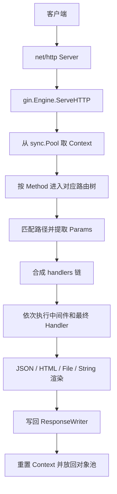

# Learn Gin

## 写在前面

这份文档基于当前目录下的 `Struct.md` 展开，但目标不是“把提纲写满”，而是把它整理成一份更适合进阶学习的 Gin 学习讲义。相比初版，这一版重点补强了三件事：

1. 增加源码视角：在关键章节加入 Gin 的核心结构体、关键函数和简化源码片段。
2. 增加教学递进：每章都尽量回答“它是什么、它为什么这样设计、它在源码里怎么落地、它在实战里怎么用”。
3. 增加进阶抓手：补充常见误区、设计权衡、阅读路径和 Mini-Gin 思路，让你能从“会用”走向“会拆、会改、会解释”。

阅读建议：

1. 第一遍按章节顺序读，建立完整认知地图。
2. 第二遍只盯四个核心对象：`Engine`、路由树、`Context`、中间件链。
3. 第三遍结合 Gin 源码对照本文中的“源码锚点”阅读。

---

## 第一部分：初识与全景（Overview）

本部分从宏观角度俯瞰 Gin 框架，了解其在 Go 原生 `net/http` 基础上的定位与整体架构。

### 第 1 章：Gin 框架概述

#### 1.1 为什么选择 Gin？（轻量、高性能、易用性）

Gin 是 Go Web 生态中最常见的框架之一。它真正有价值的地方，不只是“跑得快”，而是用很少的抽象完成了很高频的 Web 开发需求。

选择 Gin 的核心原因：

- 轻量：没有很重的容器、依赖注入系统或复杂生命周期。
- 高性能：路由使用压缩前缀树，`Context` 借助 `sync.Pool` 复用。
- 易用：API 很贴近业务开发直觉，`GET`、`POST`、`Group`、`Use`、`JSON` 很顺手。
- 工程友好：中间件、绑定、校验、恢复、渲染这些能力开箱即用。
- 易于下潜：它不是黑盒，源码很适合作为 Go 框架设计案例学习。

如果把 Go Web 开发看成三个层次：

- `net/http`：底层原语，完全灵活，但样板代码多。
- Gin：在标准库之上做高价值封装，适合大多数服务端接口场景。
- 更重型框架：约束更多，功能更全，但也更远离 Go 原生风格。

Gin 最大的魅力是“增强而不遮蔽”。你始终能看见 Go 标准库的轮廓，这也是它非常适合用来学习 Web 框架设计的原因。

#### 1.2 Gin 与原生 `net/http` 的关系

Gin 并没有绕开 Go 标准库，而是建立在 `net/http` 之上。

标准库的入口通常是：

```go
http.ListenAndServe(":8080", handler)
```

只要一个对象实现了 `http.Handler` 接口，它就能被 `net/http` 驱动：

```go
type Handler interface {
    ServeHTTP(ResponseWriter, *Request)
}
```

Gin 的 `Engine` 正是这个接口的实现者：

```go
r := gin.New()
http.ListenAndServe(":8080", r)
```

这说明：

- 网络监听、连接复用、HTTP 报文解析，仍由 `net/http` 负责。
- Gin 主要负责 `ServeHTTP` 之后的流程：路由匹配、上下文封装、中间件调度和响应输出。
- Gin 的所有高级能力，本质上都建立在 `http.Request` 和 `http.ResponseWriter` 这两个标准库对象之上。

学习 Gin 时，最重要的思维不是“记 API”，而是记住它和 `net/http` 的边界：Gin 管的是请求处理模型，不是网络协议实现。

#### 1.3 Gin 框架的整体架构图解

一次 Gin 请求从进入到结束，大致会经过如下路径：



如果按模块来理解 Gin，可以拆成六层：

- 入口层：`Engine`
- 路由层：method trees + radix tree
- 上下文层：`Context`
- 流程控制层：middleware chain
- 输入层：binding + validation
- 输出层：render

其中最重要的一点是：Gin 的很多能力都不是并列关系，而是围绕 `Context` 聚拢起来的。路由把请求送进 `Context`，中间件操作 `Context`，绑定和渲染也通过 `Context` 完成。

#### 1.4 环境准备与源码阅读指南

学习 Gin 源码，建议准备两套环境：

1. 运行环境
   - 一个最小 Gin Demo 项目，用于跑接口和打断点。
2. 阅读环境
   - 能跳转定义和查看调用链的编辑器，比如 VS Code 或 GoLand。

最小示例：

```go
package main

import "github.com/gin-gonic/gin"

func main() {
    r := gin.Default()
    r.GET("/ping", func(c *gin.Context) {
        c.JSON(200, gin.H{"message": "pong"})
    })
    r.Run(":8080")
}
```

推荐源码阅读顺序：

1. `gin.New()` / `gin.Default()`
2. `type Engine struct`
3. `(*Engine).Run()`
4. `(*Engine).ServeHTTP()`
5. 路由注册：`addRoute`
6. 路由匹配：`getValue`
7. `type Context struct`
8. `Next()` / `Abort()`
9. `binding` 和 `render` 子包

进阶阅读法：

- 先看“对外 API”。
- 再看“核心结构体字段”。
- 最后看“关键流程函数”。

这样读比一开始扎进所有细节更稳。

源码锚点建议：

- `gin.go`
- `context.go`
- `tree.go`
- `routergroup.go`
- `binding/`
- `render/`

---

## 第二部分：顶层入口（The Top - Engine）

从最顶层的 API 入手，看一个请求是如何从操作系统进入 Gin 框架的。

### 第 2 章：核心引擎 `gin.Engine`

#### 2.1 `gin.New()` 与 `gin.Default()` 的底层差异

`gin.New()` 创建一个干净的引擎，不附带任何默认中间件。

`gin.Default()` 则是在 `New()` 的基础上自动注册：

- `Logger()`
- `Recovery()`

从源码意图上可以近似理解为：

```go
func Default() *Engine {
    engine := New()
    engine.Use(Logger(), Recovery())
    return engine
}
```

这个差异背后的设计思想很值得学：

- 框架核心与默认体验分离。
- 默认值是“帮助你起步”，而不是“强制你接受框架世界观”。

实战建议：

- 想快速起项目，用 `gin.Default()`。
- 想严控日志、恢复、追踪、指标链路顺序，用 `gin.New()`。

#### 2.2 `Engine` 结构体深度剖析

`Engine` 是 Gin 的总控中心。它既是 HTTP 入口，也是全局配置、路由表和对象池的拥有者。

下面是一个适合学习的简化版结构：

```go
type Engine struct {
    RouterGroup

    trees methodTrees
    pool  sync.Pool

    maxParams        uint16
    maxSections      uint16
    trustedProxies   []string
    UseRawPath       bool
    RemoveExtraSlash bool
    RedirectTrailingSlash bool
}
```

你不需要一开始记住全部字段，但要理解它们大概分成四类：

- 路由数据：`trees`
- 复用能力：`pool`
- 路径行为配置：斜杠重定向、原始路径处理等
- 代理与安全相关配置

这里最关键的两个点：

1. `Engine` 内嵌了 `RouterGroup`
   - 所以引擎本身也能直接注册路由和中间件。
2. `Engine` 自带 `sync.Pool`
   - 请求进来时取 `Context`，结束时再放回去。

这其实已经暴露了 Gin 的核心骨架：入口对象同时维护路由和上下文复用。

#### 2.3 桥接原生 HTTP：`ServeHTTP` 方法的实现

`ServeHTTP` 是 Gin 接入 `net/http` 的关键桥梁。它的主线非常经典：

```go
func (engine *Engine) ServeHTTP(w http.ResponseWriter, req *http.Request) {
    c := engine.pool.Get().(*Context)
    c.writermem.reset(w)
    c.Request = req
    c.reset()

    engine.handleHTTPRequest(c)

    engine.pool.Put(c)
}
```

上面这段是用于理解流程的简化源码，核心动作有四步：

1. 从对象池拿到一个 `Context`
2. 把本次请求和响应对象绑定进去
3. 执行 `handleHTTPRequest`
4. 请求结束后归还 `Context`

这里体现出两个重要设计：

- `Context` 生命周期被严格限制在单次请求内。
- `ServeHTTP` 很薄，真正复杂的逻辑下沉到了后续处理函数。

对教学来说，这个函数非常重要，因为它几乎把 Gin 的整个运行哲学都摊开了。

#### 2.4 请求生命周期：从 `ListenAndServe` 到 Gin 的接管

一次请求的大致生命周期如下：

1. 客户端建立连接并发出 HTTP 请求。
2. `net/http` 解析请求并回调 `gin.Engine.ServeHTTP`。
3. Gin 从池中获取 `Context`。
4. Gin 根据 Method 和 Path 匹配路由树。
5. Gin 把全局、组级、路由级处理器合成一个链。
6. Gin 执行中间件和最终 Handler。
7. 业务通过 `Context` 输出响应。
8. 请求结束，Gin 重置并回收 `Context`。

这一章到这里，最好你能回答两个问题：

1. Gin 从哪里开始接管请求？
2. Gin 为何需要 `sync.Pool`？

如果这两个问题能回答清楚，后面的 `Context` 和路由树会容易很多。

补充：推荐自己动手打一次断点

- 在 `r.Run()` 前后打断点
- 在 `ServeHTTP()` 内打断点
- 在你的业务 Handler 内打断点

你会非常直观地看到“标准库 -> Gin -> 业务代码”的接力关系。

---

## 第三部分：深潜核心（The Inside - Router & Context）

探寻 Gin 性能卓越的真正秘密，底层的路由树与贯穿始终的上下文。

### 第 3 章：极致性能的路由树（Radix Tree）

#### 3.1 什么是基数树（Radix Tree）？与传统正则路由的对比

Radix Tree 可以看作压缩版 Trie。它不是一个字符一个节点，而是尽量把公共前缀压缩到一起。

例如这组路由：

- `/user/login`
- `/user/logout`
- `/user/profile`

它们共享 `/user/` 前缀，因此适合放在一棵前缀压缩树里。

Gin 选择 Radix Tree 的原因：

- URL 路径非常适合前缀匹配。
- 大多数业务路由不需要完整正则表达式能力。
- 相比正则，前缀树更可控，也更有利于高频请求场景下的性能稳定性。

进阶理解：

- 正则路由更像“表达能力优先”。
- Gin 的 Radix Tree 更像“吞吐与稳定性优先”。

这不是谁绝对更强，而是权衡目标不同。

#### 3.2 Gin 路由树的节点结构（`node` 结构体）

Gin 的核心节点可以简化理解为：

```go
type node struct {
    path      string
    indices   string
    children  []*node
    handlers  HandlersChain
    priority  uint32
    nType     nodeType
    wildChild bool
    fullPath  string
}
```

字段理解：

- `path`：当前节点持有的路径片段
- `indices`：子节点的索引提示，提升分支定位效率
- `children`：子节点
- `handlers`：完整命中后的处理链
- `priority`：热点路径优先
- `nType`：静态、参数、通配符等节点类型
- `wildChild`：是否存在通配子节点
- `fullPath`：原始完整路由，便于调试

这一结构很值得学，因为它体现了 Gin 的路由设计不是“只求能匹配”，而是同时考虑了：

- 匹配效率
- 冲突检测
- 调试友好性
- 对参数路由和通配路由的统一表达

#### 3.3 路由注册过程：静态路由、参数路由（`:`）与通配符路由（`*`）

当你注册：

```go
r.GET("/users/:id", handler)
r.GET("/assets/*filepath", staticHandler)
```

Gin 会把这些路由按 Method 放进对应树中，再把路径拆分并压缩进节点结构。

可以把路由分成三类：

1. 静态路由
   - 例如 `/users/list`
2. 参数路由
   - 例如 `/users/:id`
3. 通配符路由
   - 例如 `/assets/*filepath`

这里最重要的进阶点不是记定义，而是理解“冲突为什么会发生”。

例如：

- `/users/:id`
- `/users/list`

它们可能共享很长前缀，但静态段和参数段的优先级不能乱，否则匹配行为会模糊。

Gin 在注册阶段就尽量把这些问题暴露出来，而不是放到运行期碰运气。

可对照的简化流程：

```go
func (n *node) addRoute(path string, handlers HandlersChain) {
    // 比较公共前缀
    // 根据节点类型拆分或复用已有节点
    // 处理 :param 和 *wildcard
    // 最终把 handlers 挂到叶子节点
}
```

进阶教学里这一节最重要的结论是：

- 注册期越严格，运行期越快越稳。

#### 3.4 路由匹配算法：如何在微秒级找到目标 Handler

匹配时，Gin 会先按 Method 选树，再按 Path 逐层往下走。

匹配优先级通常可概括为：

1. 静态节点优先
2. 参数节点次之
3. 通配符最后

一段近似的理解代码：

```go
value := root.getValue(path, params, skippedNodes, unescape)
handlers := value.handlers
params   := value.params
```

`getValue` 做的事大致包括：

- 比较当前路径和节点前缀是否匹配
- 如果是参数节点，提取参数值
- 如果是通配符节点，接住剩余路径
- 最终返回命中的处理链与参数结果

高性能的原因：

- Method 分树，缩小搜索范围
- 前缀压缩，减少比较次数
- 参数提取和匹配合并在一条流程里完成
- 数据结构在启动时就构建好，运行期不做重构

实战启发：

- 路由设计要尽量语义清晰、层次稳定
- 少用过宽的通配符
- 对高频路径，路径结构越规整，后续排查越轻松

#### 3.5 方法树（Method Trees）：不同 HTTP Method 的隔离设计

Gin 按不同 HTTP Method 维护不同的树，例如：

- `GET`
- `POST`
- `PUT`
- `DELETE`

这意味着：

- 相同路径在不同 Method 下互不干扰
- 路由匹配范围天然被压缩
- Method Not Allowed 与 Not Found 可以区分处理

比如：

```go
r.GET("/users/:id", getUser)
r.PUT("/users/:id", updateUser)
r.DELETE("/users/:id", deleteUser)
```

这三个路由路径相同，但在 Gin 内部并不冲突，因为它们根本不在同一棵树上。

进阶教学中要进一步看到一个点：

- Gin 的高性能不只是某个“神奇算法”，而是多个“小而对”的结构化选择叠加出来的。

### 第 4 章：框架的灵魂 `gin.Context`

#### 4.1 为什么需要 `Context`？

如果只使用 `net/http`，Handler 通常长这样：

```go
func(w http.ResponseWriter, r *http.Request)
```

这当然能工作，但在一个完整请求处理中，我们往往还需要：

- 路由参数
- 查询参数
- 表单数据
- JSON 绑定
- 错误收集
- 中间件共享数据
- 响应状态和写入控制

Gin 用 `Context` 把这些请求相关能力统一收拢起来，于是业务 Handler 变成：

```go
func(c *gin.Context)
```

这不是简单“少传两个参数”而已，而是把 Gin 的全部流程控制和扩展能力聚合到了同一对象上。

#### 4.2 `Context` 结构体全解析：请求、响应、元数据

下面是一个适合理解的简化版 `Context`：

```go
type Context struct {
    Request *http.Request
    Writer  ResponseWriter

    Params   Params
    handlers HandlersChain
    index    int8
    fullPath string

    engine *Engine
    Keys   map[string]any
    Errors errorMsgs
}
```

可以把它拆成五类职责：

1. 请求输入：`Request`
2. 响应输出：`Writer`
3. 路由结果：`Params`、`fullPath`
4. 流程控制：`handlers`、`index`
5. 共享元数据：`Keys`、`Errors`

这里最关键的其实是 `handlers` 和 `index`，因为它们决定了中间件为什么能前后包裹执行。

教学上的重点不只是知道字段名，而是理解：

- `Context` 不是一个“参数工具箱”
- 它是 Gin 请求执行状态的核心载体

#### 4.3 零分配性能优化：`sync.Pool` 在 `Context` 复用中的应用

Gin 没有为每个请求都分配一个全新 `Context`，而是通过 `sync.Pool` 做复用。

粗略流程如下：

```go
engine.pool.New = func() any {
    return engine.allocateContext(engine.maxParams)
}
```

请求来了：

- `Get()` 取一个 `Context`
- 重置字段
- 绑定新请求
- 请求结束后 `Put()` 回去

为什么这很重要：

- HTTP 请求通常短而频繁
- 上下文对象天然属于高频短生命周期对象
- 如果每次都分配，会给 GC 制造不必要压力

但进阶使用必须牢记：

- `Context` 会被复用
- 请求结束后继续持有原始 `Context` 非常危险

这直接引出下一节的并发问题。

#### 4.4 参数获取的底层逻辑：Query、Param、Form 与 Header

Gin 提供了不同来源参数的统一访问方式：

- 路由参数：`Param`
- 查询参数：`Query` / `GetQuery`
- 表单参数：`PostForm`
- Header：`GetHeader`

它们的底层来源分别是：

- `Param`：路由树匹配阶段提取好的 `Params`
- `Query`：`Request.URL.Query()`
- `Form`：`Request.ParseForm()` 后的表单数据
- `Header`：`Request.Header`

示例：

```go
id := c.Param("id")
page := c.DefaultQuery("page", "1")
token := c.GetHeader("Authorization")
name := c.PostForm("name")
```

这里的进阶点在于：

- Gin 并没有创造新数据源，它只是帮你把不同来源的数据统一收口了。
- 这种 API 设计非常适合中大型项目，因为它让业务代码更稳定、更可读。

#### 4.5 并发陷阱：`Context.Copy()` 的原理与使用场景

这是 Gin 中很容易踩坑的地方。

错误写法：

```go
go func() {
    log.Println(c.Request.URL.Path)
}()
```

因为原始 `Context` 在请求结束后可能会被回收到池中，下次请求再复用。此时后台 goroutine 再访问它，就是未定义风险。

正确做法：

```go
copied := c.Copy()
go func() {
    log.Println(copied.Request.URL.Path)
}()
```

可近似理解的 `Copy()` 意图：

```go
func (c *Context) Copy() *Context {
    cp := *c
    cp.Keys = maps.Clone(c.Keys)
    return &cp
}
```

这里的重点不在于一字不差背源码，而在于理解它解决的问题：

- 避免直接跨 goroutine 持有会复用的上下文对象
- 为异步日志、审计、消息投递提供较安全的只读视图

实战中更推荐的方式其实是：

- 不传整个 `Context`
- 只提取必要字段组成你自己的任务参数对象

---

## 第四部分：由内向外（The Outside - Middleware & Modules）

从核心 `Context` 向外围延伸，剖析 Gin 的插件化机制与功能模块。

### 第 5 章：洋葱模型与中间件（Middleware）

#### 5.1 责任链模式在 Gin 中的实现：`HandlersChain`

Gin 中间件的统一函数签名是：

```go
type HandlerFunc func(*Context)
```

因此，无论是全局中间件、组中间件，还是最终业务处理器，都可以被装进同一个切片：

```go
type HandlersChain []HandlerFunc
```

这就是 Gin 责任链模型的基础。

一次请求的最终执行链通常长这样：

```text
全局中间件 -> 路由组中间件 -> 路由级中间件 -> 最终 Handler
```

为什么很多人把它叫“洋葱模型”：

- 进入时一层层向内
- 返回时再一层层向外

这也就是为什么一个中间件可以同时做前置和后置逻辑。

#### 5.2 核心流转控制：`Next()` 与 `Abort()` 的源码解析

`Next()` 的核心在于推进 `index`：

```go
func (c *Context) Next() {
    c.index++
    for c.index < int8(len(c.handlers)) {
        c.handlers[c.index](c)
        c.index++
    }
}
```

这段逻辑是 Gin 中间件机制最值得反复看的源码之一。它解释了：

- 为什么中间件按顺序执行
- 为什么 `c.Next()` 之后还能继续执行当前函数后半段

而 `Abort()` 的本质，则是把索引推进到一个“后续不再继续”的状态。常见场景：

```go
func auth(c *gin.Context) {
    if c.GetHeader("Authorization") == "" {
        c.AbortWithStatusJSON(401, gin.H{"error": "unauthorized"})
        return
    }
    c.Next()
}
```

必须强调：

- `Abort()` 不会自动结束当前函数
- 所以实际代码里通常要紧跟 `return`

#### 5.3 全局中间件、路由组中间件与单路由中间件的合并逻辑

Gin 中间件分三层：

1. 全局：`engine.Use(...)`
2. 分组：`group.Use(...)`
3. 单路由：`GET(path, m1, m2, handler)`

最终都会合并成一条 `HandlersChain`。

合并顺序非常重要：

```text
全局 -> Group -> Route -> Endpoint Handler
```

这意味着：

- 日志、恢复这类横切能力通常放前面
- 鉴权、权限、租户注入通常在业务处理前
- 最终业务 Handler 永远在链尾

进阶上一定要形成一个判断习惯：

- 中间件本身写得对，不等于挂载顺序就一定对

很多线上问题，根本不是代码错，而是顺序错。

#### 5.4 经典内置中间件剖析：`Logger` 与 `Recovery`

`Logger`：

- 负责访问日志
- 统计状态码、耗时、客户端 IP、路径等

`Recovery`：

- 捕获未处理 panic
- 避免单个请求把整个进程拖死
- 输出错误信息并返回 500

为什么要在进阶教学里单独分析这两个：

- 它们代表 Gin 默认工程能力的下限
- 也代表中间件最经典的两种职责：
  - 观测型
  - 兜底型

源码理解上，你可以重点观察：

- 它们如何在 `c.Next()` 前后记录信息
- `Recovery` 如何 `defer` + `recover`

### 第 6 章：数据绑定与校验（Binding & Validation）

#### 6.1 `ShouldBind` 与 `MustBind` 系列的区别

Gin 的绑定大致有两种风格：

- `ShouldBind*`
- `MustBind*`

区别在于：

- `ShouldBind*` 把错误返回给业务决定
- `MustBind*` 绑定失败时直接中断并写错误响应

进阶开发里更推荐 `ShouldBind*`，因为它更利于：

- 统一错误码
- 统一响应格式
- 统一国际化或字段翻译

示例：

```go
var req LoginRequest
if err := c.ShouldBindJSON(&req); err != nil {
    c.JSON(400, gin.H{"error": err.Error()})
    return
}
```

对于成熟项目，这一节最重要的不是区分 API，而是形成一个习惯：

- 框架帮你解析
- 错误表达必须由你的业务规范来接管

#### 6.2 Binding 接口的设计：如何支持 JSON、XML、YAML、Form

Gin 没有把所有绑定逻辑硬写进 `Context`，而是抽象出 Binding 接口体系。

它支持的常见输入包括：

- JSON
- XML
- YAML
- Form
- Query
- URI
- Header

一个简化理解：

```go
type Binding interface {
    Name() string
    Bind(*http.Request, any) error
}
```

这个设计很漂亮，因为它做到了两件事：

1. 不同输入格式有统一接口
2. 上层调用方式依旧简洁

例如：

```go
c.ShouldBindJSON(&req)
c.ShouldBindQuery(&query)
c.ShouldBindUri(&uri)
```

从教学角度，这里要特别指出一个进阶事实：

- Gin 的绑定强大，不在于 API 多
- 而在于它把“请求来源差异”折叠到了统一抽象里

#### 6.3 探秘底层：基于反射（`reflect`）的结构体赋值

Gin 绑定结构体依赖反射。这意味着它会：

1. 遍历目标结构体字段
2. 读取标签，如 `json`、`form`、`uri`
3. 从请求中找值
4. 转换成目标类型
5. 写回字段

比如：

```go
type UserQuery struct {
    Page int    `form:"page"`
    Sort string `form:"sort"`
}
```

当你调用：

```go
c.ShouldBindQuery(&q)
```

Gin 底层其实在做一轮“标签驱动的字段写入”。

这里的进阶知识点是性能权衡：

- 反射不便宜
- 但它极大提升了开发效率
- Gin 把主要性能预算投在路由和上下文，而不是把绑定也优化到极致零成本

这是一种非常成熟的工程取舍。

#### 6.4 结合 `go-playground/validator` 的参数校验机制

Gin 常配合 `go-playground/validator` 做校验：

```go
type LoginRequest struct {
    Username string `json:"username" binding:"required,min=3,max=20"`
    Password string `json:"password" binding:"required,min=6"`
}
```

调用绑定时，Gin 会进一步触发校验。

这一机制的价值在于：

- 声明式
- 贴近结构体定义
- 易于复用和治理

但进阶项目不能停留在“能校验”：

- 要把错误翻译成人类能读懂的信息
- 要避免把底层英文错误直接暴露给前端
- 要为业务域定义自定义校验器

补充源码抓手：

- 看 Gin 如何持有 validator 引擎
- 看标签解析与错误对象如何生成

### 第 7 章：响应与渲染引擎（Render）

#### 7.1 `Render` 接口的设计模式

Gin 把响应渲染抽象成统一接口，而不是在 `Context` 里写一大堆特判。

可以近似理解为：

```go
type Render interface {
    Render(http.ResponseWriter) error
    WriteContentType(http.ResponseWriter)
}
```

这使得 JSON、HTML、XML、字符串、文件等输出方式，能在统一模型下工作。

进阶意义：

- 输出能力可以模块化扩展
- `Context` 只做组织，不做所有细节

这是典型的“行为抽象优于格式分支硬编码”。

#### 7.2 JSON 渲染原理与防劫持（SecureJSON）

最常见的输出方式：

```go
c.JSON(200, gin.H{"message": "ok"})
```

底层大致做了三件事：

1. 写 `Content-Type`
2. 序列化数据
3. 写出状态码和响应体

而 `SecureJSON` 的意义，在于应对旧式 JSON Hijacking 风险。虽然在现代 API 场景里用得少了，但它能帮助你理解 Gin 的响应封装并不只是“把对象转成 JSON”。

教学上建议再补一个认知：

- 输出 JSON 不等于“输出安全”
- 还要考虑错误泄露、缓存头、跨域和敏感字段脱敏

#### 7.3 HTML 模板渲染的底层封装

Gin 支持服务端 HTML 模板渲染，但底层仍然依赖 Go 标准库的 `html/template`。

示例：

```go
r.LoadHTMLGlob("templates/*")
r.GET("/home", func(c *gin.Context) {
    c.HTML(200, "home.tmpl", gin.H{"title": "Home"})
})
```

Gin 在这里的价值主要是：

- 帮你管理模板加载
- 提供统一调用入口
- 把模板渲染和 HTTP 响应流程衔接起来

这也是 Gin 一贯的风格：利用标准库，补工程使用层的便利。

#### 7.4 响应流的写入控制与 HTTP 状态码管理

Gin 对 `ResponseWriter` 做了包装，以便追踪：

- 状态码
- 是否已经写头
- 写出了多少字节

这对中间件非常关键，因为日志、错误处理、指标采集都依赖这些信息。

简化理解：

```go
type responseWriter struct {
    http.ResponseWriter
    size   int
    status int
}
```

进阶要点：

- Header 必须在响应体之前写
- 一旦开始写流，就不要指望后面还能随便改状态码
- 如果你的中间件准备兜底写错，要先判断响应是否已经开始输出

---

## 第五部分：实战与进阶（Advanced & Practice）

跳出源码，探讨在生产环境中如何最佳地使用和改造 Gin。

### 第 8 章：进阶特性与生产实践

#### 8.1 优雅重启与平滑升级（Graceful Shutdown）

生产服务关闭时，不能粗暴退出，否则会造成：

- 正在处理的请求被中断
- 数据未刷写完成
- 调用方收到异常错误

Gin 作为 `http.Handler`，天然可以配合 `http.Server` 做优雅关闭：

```go
srv := &http.Server{
    Addr:    ":8080",
    Handler: r,
}
```

关闭时通常要做三件事：

1. 停止接收新请求
2. 等待在途请求处理完成
3. 超时后再强制退出

真正的进阶点是：这不是 Gin 的“附加功能”，而是你需要把 Gin 放回标准库服务模型中去理解。

#### 8.2 在 Gin 中正确使用 Goroutine 异步处理请求

Gin 可以在 Handler 中启 goroutine，但要分清哪些事适合异步：

适合异步：

- 埋点
- 审计日志
- 事件投递

不适合异步：

- 还影响本次响应结果的核心逻辑
- 继续使用原始 `Context`
- 在后台 goroutine 中写响应

推荐模式：

- 尽量只传业务字段
- 必要时使用 `c.Copy()`
- 更复杂场景升级为队列或 worker，而不是“随手起 goroutine”

#### 8.3 自定义日志输出与格式化

默认日志适合开发期，但生产里通常需要：

- 结构化日志
- request ID / trace ID
- 统一字段规范
- 访问日志与错误日志分离

Gin 中常见做法：

1. 用 `LoggerWithFormatter` 做轻定制
2. 自己写日志中间件，统一落结构化字段

推荐日志字段：

- 时间
- 方法
- 路径
- 状态码
- 耗时
- 客户端 IP
- request ID
- user ID
- error

进阶上要注意：

- 日志格式一旦散掉，后续治理会非常痛苦
- 错误日志、访问日志、审计日志尽量分层

#### 8.4 如何为 Gin 编写一个高质量的开源中间件

高质量中间件通常具备这些特征：

- 配置清晰
- 默认值合理
- 不滥用 `Context.Keys`
- 错误行为可预测
- 文档完整
- 测试充分
- 性能克制

推荐思考框架：

1. 这个中间件是“观测型”还是“拦截型”？
2. 它是否会中断后续链路？
3. 它要向后续 Handler 暴露哪些数据？
4. 它是否依赖响应头、状态码或 body？

适合作为中间件的典型能力：

- 请求 ID
- 鉴权
- 租户注入
- 限流
- 链路追踪
- 指标采集

### 第 9 章：总结与升华

#### 9.1 造轮子实战：从零手写一个“Mini-Gin”框架（核心功能的极简实现）

真正理解一个框架，最有效的方法之一就是自己写一个简化版。

一个最小可用的 Mini-Gin 可以包含：

1. `Engine`
2. 路由注册
3. 简单匹配
4. `Context`
5. 中间件链
6. `JSON()` / `String()` 输出

示例骨架：

```go
type HandlerFunc func(*Context)

type Context struct {
    Writer   http.ResponseWriter
    Request  *http.Request
    handlers []HandlerFunc
    index    int
}

func (c *Context) Next() {
    c.index++
    for c.index < len(c.handlers) {
        c.handlers[c.index](c)
        c.index++
    }
}

type Engine struct {
    routes map[string]map[string]HandlerFunc
}

func (e *Engine) ServeHTTP(w http.ResponseWriter, r *http.Request) {
    if methodRoutes, ok := e.routes[r.Method]; ok {
        if h, ok := methodRoutes[r.URL.Path]; ok {
            c := &Context{Writer: w, Request: r, index: -1}
            c.handlers = []HandlerFunc{h}
            c.Next()
            return
        }
    }
    http.NotFound(w, r)
}
```

这一版虽然远称不上 Gin，但已经暴露了框架的骨架：

- 请求入口是 `ServeHTTP`
- 请求状态由 `Context` 承担
- 路由负责找到处理器
- 中间件本质上是统一签名的责任链

更进一步的练习路径：

1. 先用 `map` 路由
2. 再改成前缀树
3. 再补参数路由
4. 再补对象池
5. 最后再补 Binding / Render 抽象

这样你会非常直观地体会到 Gin 的每个设计到底在解决什么问题。

#### 9.2 Gin 框架设计的优秀思维总结（接口设计、池化技术、责任链）

Gin 值得学的，不只是 API，而是它背后的设计方法。

可以总结成五点：

1. 在标准库之上做增强，而不是另起炉灶
2. 把性能优化打在真正高频的路径上
3. 用统一抽象折叠复杂度
4. 用责任链提升扩展性
5. 保持核心精简，避免框架过度膨胀

这些思想不只适用于 Gin，也适用于你写自己的业务框架或公共组件。

---

## 补充：作为进阶教学材料，初版有哪些不足

为了让这份文档更像“进阶教学”而不只是“完整笔记”，有几个不足必须明确指出：

1. 源码锚点不足
   - 初版偏概念讲解，知道“有什么”，但不够知道“源码在哪、怎么读”。
2. 关键结构体拆得不够细
   - 尤其是 `Engine`、`Context`、`node`、`responseWriter`，如果没有字段级理解，很难真正下潜。
3. 调用链不够具体
   - 比如 `ServeHTTP -> handleHTTPRequest -> tree.getValue -> c.handlers -> c.Next()` 这条主线应该更明确。
4. 缺少源码片段支撑
   - 进阶文档不能只有结论，至少要让读者看到几个关键函数长什么样。
5. 缺少“为什么这样设计”的对比
   - 比如为何用前缀树而不是正则、为何要池化 `Context`、为何把中间件做成责任链。
6. 缺少实践中的危险边界
   - 尤其是 `Context` 复用、异步 goroutine、响应写入时机这些易错点。

这一版已经针对这些问题做了定向加强。

## 补充：推荐源码阅读主线

如果你准备真正把 Gin 看进去，建议按这条主线读：

1. `gin.New()`
2. `type Engine struct`
3. `(*Engine).ServeHTTP()`
4. `(*Engine).handleHTTPRequest()`
5. `tree.addRoute()`
6. `tree.getValue()`
7. `type Context struct`
8. `(*Context).Next()`
9. `(*Context).Abort()`
10. `binding` / `render`

为什么这么排：

- 先看入口
- 再看数据结构
- 再看请求主链
- 最后再看扩展模块

不要上来就读 `binding` 和 `render`，它们重要，但不是 Gin 最核心的骨架。

## 补充：常见误区

初学和进阶阶段常见的误区有这些：

- 误以为 Gin 取代了 `net/http`
  - 实际上它是增强层。
- 误以为框架性能只取决于“快不快”
  - 实际性能还包括日志、序列化、数据库、缓存和错误处理。
- 误以为中间件只是前置过滤器
  - 它其实是完整责任链。
- 误以为 `Context` 可以安全跨 goroutine 长时间持有
  - 请求结束后会被回收复用。
- 误以为理解了 CRUD 就等于理解了 Gin
  - 真正理解来自结构体、调用链和设计权衡。

## 补充：进阶练习题

如果你想验证自己是否真的吃透了本文，可以尝试回答这些问题：

1. 为什么 `Engine` 要内嵌 `RouterGroup`？
2. `Context` 为什么适合放进 `sync.Pool`，但数据库连接不适合？
3. Gin 为何把不同 HTTP Method 分成多棵树，而不是一棵树里再判断？
4. `Next()` 为什么可以实现“前置 + 后置”中间件模型？
5. `Abort()` 为什么通常要跟 `return` 一起使用？
6. 为什么异步任务中更推荐提取必要字段，而不是直接传 `Context.Copy()`？
7. 如果你手写一个 Mini-Gin，第一版最值得省略的模块是什么，为什么？

## 结语

Gin 的优秀之处，不在于它“功能特别多”，而在于它把高频 Web 场景中最重要的几件事做得非常克制、非常稳：入口简单、路由高效、上下文统一、中间件优雅、扩展边界清晰。

如果你把 `Engine`、路由树、`Context` 和中间件链这四件事真正吃透，那么 Gin 对你来说就不再只是一个会调用的框架，而会变成一个你能解释、能调试、能扩展、甚至能自己重构出核心骨架的设计样本。
